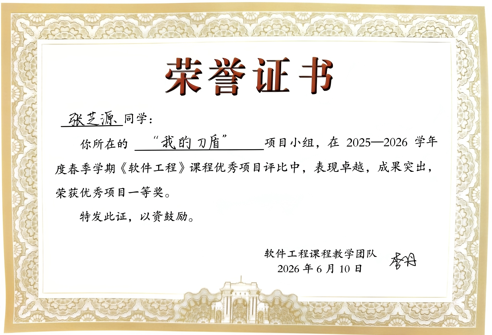

# Software Engineering

Course-related files for **Software Engineering**, Tsinghua University, Spring 2026.

This repository contains selected homework answers and project-related materials from the course.

## Course Project

Our course project was **Aegis Instant Messaging**, an instant messaging system developed for the final project.

Project repository: [Yanis01682/Aegis-Instant-Messaging](https://github.com/Yanis01682/Aegis-Instant-Messaging)

The project won **First Prize in the Excellent Course Project Evaluation**.



## Structure

```text
.
├── Assignments/   # Selected homework answers and original submissions
└── Project/       # Project award image and related materials
```

## Notes

Some course materials may belong to the course staff or university. Please respect the original copyright and course policies.
